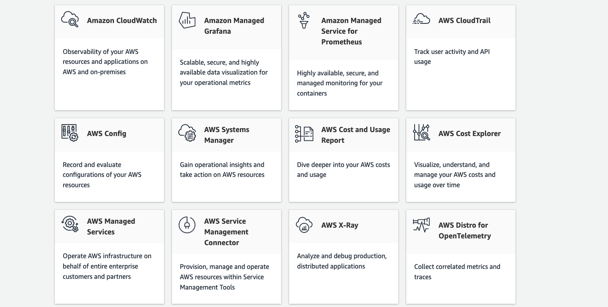
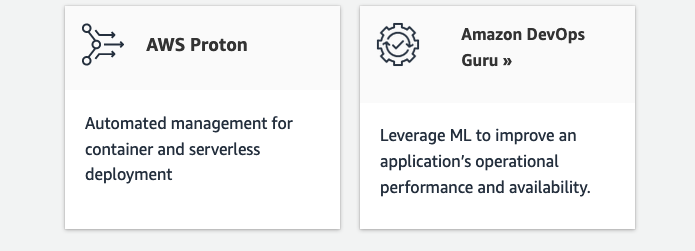

# Enable builders for speed with built-in governance control.

## AWS Control Tower
Setup and govern secure multi-account AWS environment

## AWS Organizations
AWS organization is a new feature that allows you to manage multiple accounts as if they were a single entity. It provides consolidated view

## AWS Budgets
Cost Explorer

# Provision

# Operate

 ## CloudWatch
 Metrics and Logging

 ##  AWS Config
 Record configuration changes in your account, including resource types and actions performed on them. You can use the recorded information to audit or troubleshoot changes.

 ## CloudTrail
 Auditing of API calls to resources in your account, including actions taken by users, roles, and services that are integrated with AWS Management Console or command

 ## Systems Manager
Optimize perf and security across large amount os systems

## Amazon X-Ray
Analyze and Debug prod application

## CloudFormation
Define  infrastructure as a Code
Json or Yaml conf accepted
it creates a stack 

## AWS CloudWatch
Collect and displays data  and  you can  set alarms  and Log Store

## Auto Scaling
Minimum = 1
Desired = 2 (want to use using CloudWath to scale )

EC2 DynamoDB Aurora applies 
