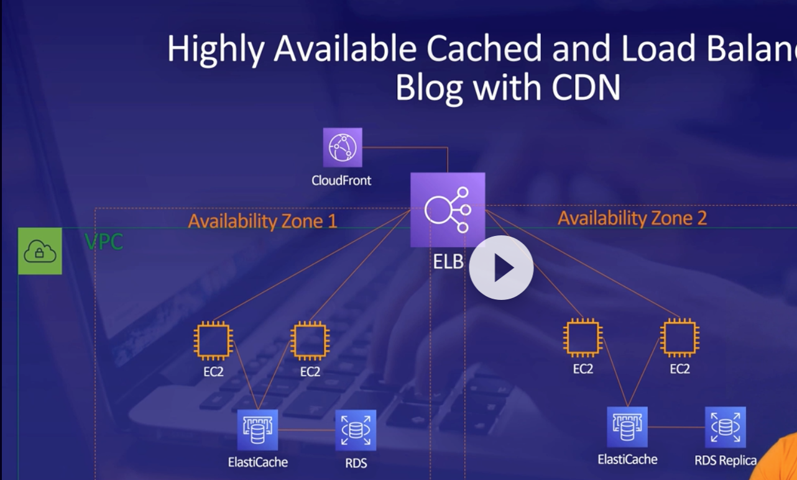
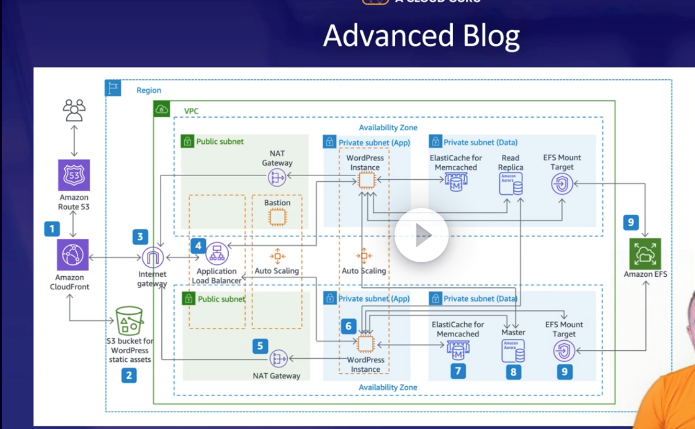

# Mashine Learnung AI

## AWS  Kendra
AWS Kendra is a fully managed service that makes it easy for developers to add a search experience to their applications.

## Amazon Personalize
Personalize Recomendation

# Business Metrics AI

## Amazon Lookout for Metrics
detect unexpected revenue 
 
## Forecast
predict future sales

## Fraud Detection
identify potentially fraud online activities

# Vision AI

## Recognition
Analaze images and  videos and extract meening

# Language AI

## Polly
convert text to speech

## Transcribe
transcribe audio files into text

## Lex
build conversational interfaces as bots

# CodeGuru
debug code, performance issues

# IDEA

and

https://aws.amazon.com/blogs/architecture/