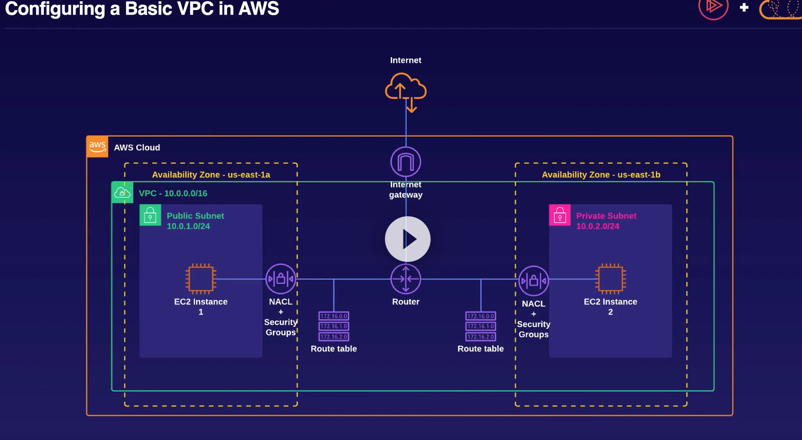

# VPC
Virtual Private network

# AWS Transit Gateway
A service that allows you to connect your virtual private clouds (VPCs) and on-premises networks through a single gateway.

# AWS PrivateLink
Private connectivity between virtual private clouds (VPCs), supported AWS services, and your on-premises networks without exposing your traffic to the public internet. 

=Network Scaling=
# Elastic Load Balancer
A load balancer automatically scales as the application's demand changes.

# AWS Global Accelerator
Provides two global static public IPs that act as a fixed entry point to your application endpoints

=Content Delivery=
# CloudFront
CDN is an Amazon Web Services (AWS) web service for content delivery, which can be used to distribute media files or other objects to end users

==LAB==
